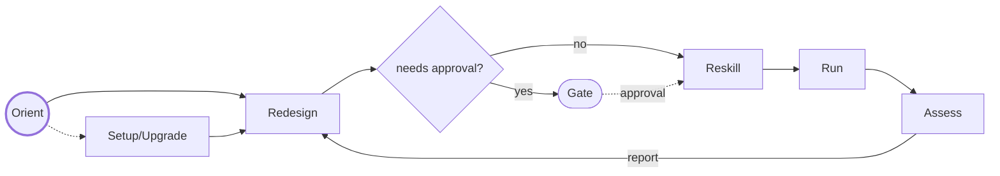

  

# ZOE — Zero Organisation Enterprises

ZOE kernel is a minimal set of agentic instructions and skills to turn any
idea or vision into a self-managing and self-improving process that we call an
**enterprise**.

ZOE captures your vision as a **charter**, and then builds, runs, and
continuously improves whatever is needed to realise it. ZOE works as a kind
of general manager, while humans typically act in 'director' roles.

When we say "enterprise" we mean the pursuit of any high-level goal, which
could be as much a personal life goal as a commercial business project —
anything where you want the boring, repetitive work — book-keeping and
admin — managed by AI.

We call a running instance **a ZOE**. Once set up, a ZOE should almost run
itself. You own the charter and approve the big calls; it does the rest.

## How to use

Point your AI at the instruction file and the skills under `kernel/` and ask
it how to proceed. ZOE opens the conversation itself: it knows it has no goal
yet, and it guides you through the first draft of your charter. From there,
the cycle takes over.

Alternatively, get your AI to read *this* file and help you wire in the
instructions and skills.

### Getting started

During setup the AI interviews you and drafts your charter: this contains the
vision, scope, success criteria, hard rules, and resource constraints. It also
creates **the index**: its own map of where everything lives and the settings
it runs by.

A good charter is crucial: everything a ZOE does afterwards is traceable
back to it. It can be updated later of course, to improve it or as goals shift.

A ZOE creates and maintains its own skills according to what the enterprise
needs.

### The cycle — how work gets done

A ZOE runs a continuous loop:

- **Orient** — every session starts here with some basic checking,
  picking up from where it was last left.
- **Setup/Upgrade** — used if running for the first time, or if the kernel or
  a ZOE we depend on has been upgraded.
- **Redesign** — decides what skills to add, change or delete, based on the
  charter and the last cycle's results. Uses a separate agent.
- **Gate** — anything the charter marks as needing approval waits
  until a director gives the go ahead.
- **Reskill** — make the approved skill changes.
- **Run** — this is where the real work gets done: the work that makes
  this ZOE fulfil the charter.
- **Assess** — judge the results against the charter's definition of success,
  honestly, using a separate agent from the one that did the work.

Deciding, doing, and judging are deliberately kept apart — the agent that
does the work never gets to be the agent that certifies it.

### Self-improvement

Improvement is the first thing each cycle does (*Redesign*). Each cycle,
the ZOE redesigns its own skill set — creating skills it's missing,
sharpening ones that underperform, and deleting any dead weight.

### Sub-ZOEs

When a sub-goal grows its own definition of success and its own rules, a ZOE
can propose spinning it off as a sub-enterprise — a *sub-ZOE* with its
own charter, operating under a parent ZOE.

### Upgrades

Skills inherited from parent ZOEs are never edited. The only time they change
is from parent upgrades. The upgrade skill checks upstream for new releases
on a schedule you choose, and will always ask before upgrading.

### Feedback

When a ZOE finds something a parent or otherwise related ZOE should do better,
it sends feedback upstream. Feedback arriving from downstream also gets
handled. Improvements flow up and improved releases flow back down.

### Template ZOEs

Some ZOEs are abstract and not meant to be run as-is. They act as a parent
whose sub-ZOEs inherit more specific instructions and skills. We call these
**template ZOEs**. For example
[ZOE SDLC](https://github.com/stainsby/zoe-sdlc) is a template for software
engineering projects.

### Guardrails

Guardrails keep the AI from overstepping:

- **Gating** — the charter's rules name the actions that need human oversight
  — spending money, publishing, changing key files, whatever you decide. A
  gated action that isn't approved is prohibited; the ZOE must stop and
  ask.
- **Verification** — verifiability is key to automation. Success is measured
  by well-defined outcomes that will be documented in the charter.

## The kernel skills

The kernel's skills are built to work like an **orthonormal basis** — a concept
borrowed from *vector spaces* in mathematics: small, perpendicular directions
that can be scaled to describe any point in a space. Similarly, the kernel's
skills aim to be:

- **Minimal** — each skill does one job, completely, nothing extra.
- **Independent** — no skills overlap; each covers ground no other touches.
- **Complete** — together they span everything the cycle needs, so any
  behaviour a ZOE requires is a *combination* of skills.

This is how the kernel can stay small. The same criteria apply to the skills a
ZOE builds for itself as it evolves.

Here is the full set:

| Skill | What it does |
| --- | --- |
| `zoe-setup` | First setup, with a director present: writes the charter and index and makes the enterprise runnable. Also assists when you revise the charter later. |
| `zoe-redesign` | Decides what to change in the ZOE's own skill set — create, improve, delete — at the start of each cycle, as a separate agent from the ones that carry changes out. |
| `zoe-reskill` | Carries out one change from the plan: create, improve, or delete one of the ZOE's own skills. Runs once for each change. |
| `zoe-orient` | Picks up where it left off from the last session and gets ready to do work. |
| `zoe-run` | Executes the skills and tasks that are due, on schedule or on an event; acquires a tool where a skill needs one and lacks it. |
| `zoe-assess` | Judges each cycle's results against the charter's success criteria and issues an append-only report — as a separate agent from the ones whose work it judges. |
| `zoe-tasks` | An *understanding* skill: the canonical statement of what a task is, what any task store must provide, and how long work is decomposed. |
| `zoe-upgrade` | Checks whether a newer kernel is available upstream and, with your approval, adopts it. |
| `zoe-reconcile` | Updates the ZOE's own records to match a new kernel version. Called by `zoe-upgrade`. |
| `zoe-feedback` | The feedback loop, both directions: sends identified feedback upstream, and deals with feedback arriving on the ZOE's intake. |

## Host capabilities

### What the host must provide

- At the top level, the most process-capable model available.
- A long-running loop, triggerable on a schedule and on events — though a human
  driving it through chat works too.
- Correct presentation of both core and dynamically created skills and
  instructions to the AI.
- A human-gate primitive: pause, ask a person, block until approved.
- Skill management and editing.

### What the host might provide

- Native tools.
- Tool access with dynamic acquisition (e.g. MCP).
- Sub-agents.
- Various forms of durable storage.
- Any other tools the enterprise might need and has decided not to build itself.

### Host adapters

The kernel is host-neutral and is the only thing ZOE prescribes. `hosts/`
carries adapters for specific hosts: agent files that keep deciding, doing
and judging in separate agents, plus notes covering each host's strengths and
gaps.

Treat them as workable examples, not part of the kernel proper — adapt them
freely to your setup, or write your own for another host. They may move to a
separate ZOE-related project in time.

Currently, there is only one host example:

- `hosts/claude-code/` — **Claude Code**, as CLI or VS Code extension. This is
  a thoroughly tested case.
