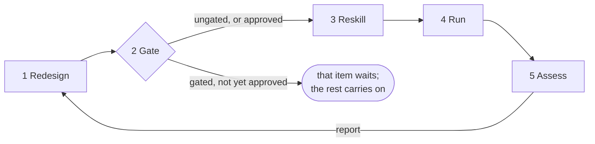

  

# ZOE — Zero Organisation Enterprises

A minimal set of agentic instructions and skills to turn any vision into a
self-managing and self-improving **enterprise**. ZOE captures your ideas as a
**charter**, and then builds, runs, and continuously improves whatever is
needed to realise it. ZOE works as a kind of general manager, while you act
in a 'director' role.

When we say "enterprise" we mean any high-level goal. Examples might be
a personal life goal, or a commercial project. Anything where you want the
drudgery managed by AI.

## How a ZOE works

We call a running instance **a ZOE**. Once set up, a ZOE should almost run
itself. You own the charter and approve the big calls; it does the rest.

### Getting started

See *How to use* first.

The setup skill interviews you, drafts your charter: this contains the vision,
scope, success criteria, hard rules, and resource constraints. It also creates
**the index**: its own map of where everything lives and the settings it runs
by.

A good charter is crucial: everything a ZOE does afterwards is traceable
back to it.

### The cycle — how work gets done

A ZOE runs a continuous loop:

1. **Redesign** — decide what to change in its own skill set, based on the
   charter and the last cycle's results.
2. **Gate** — anything the charter marks as needing your approval stops here
   until you say go. No exceptions: not for urgency, not for a clever shortcut.
3. **Reskill** — carry out the approved changes, one at a time.
4. **Run** — execute the skills and tasks that are due.
5. **Assess** — judge the results against the charter's definition of success,
   honestly, as a separate agent from the one that did the work.

Then back to step 1. Deciding, doing, and judging are deliberately kept apart —
the thing that does the work never gets to be the thing that certifies it.

### Self-improvement

Improvement isn't a feature bolted on; it's step 1 of every cycle. Each pass,
the ZOE redesigns its own skill set — creating skills it's missing, sharpening
ones that underperform, and deleting as readily as it adds, because a skill set
that only grows loses coherence. Every change is verified before it goes live,
and anything the charter gates waits for you.

### Upgrades

Skills inherited from parent ZOEs are never edited. The only time they change
is from parent upgrades.

The upgrade skill checks parents for new releases on a schedule you choose,
and will always ask before upgrading.

### Feedback

When a ZOE finds something a parent or otherwise related ZOE should do better,
it sends feedback upstream. Feedback arriving from downstream also gets
handled. Improvements flow up and improved releases flow back down.

### Sub-enterprises

When a sub-goal grows its own definition of success and its own rules, a ZOE
can propose spinning it off as a dependent enterprise — a peer or child ZOE
with its own charter.

### Template ZOEs

Some ZOEs are abstract and not meant to be run as-is. They act as a blueprint:
a parent whose sub-ZOEs inherit instructions and skills the kernel cannot give
them — how to run a software project, keep books, do research, and so on. We
call these **template ZOEs**. For example: *zoe-sdlc* (coming soon), a template
for software projects.

To its sub-ZOEs, a template ZOE works the way the kernel works for every
ZOE: as a layer to build on.

### Guardrails — gates and verification

Two things keep all this honest:

- **Gates.** The charter's hard rules name the actions that need a human first
  — spending money, publishing, changing key files, whatever you decide. A
  gated action that isn't approved simply doesn't happen; the ZOE stops and
  asks.
- **Verification.** ZOE treats "I can't verify this" as a problem to fix, not a
  condition to accept. Success is measured by well-defined outcomes and audits
  — not by the agent's feelings. What can't be measured gets flagged to you as
  a known blind spot rather than ignored.

## Design

The kernel's skills are built to work like an **orthonormal basis** — a concept
borrowed from mathematics: in geometry, an orthonormal basis is the smallest
set of directions that lets you describe any point in a space: each direction
is unit-length (no bigger than it needs to be), the directions don't overlap
(each is at right angles to the others), and together they cover the whole
space.

The kernel's skills aim for the same three properties:

- **Minimal** — each skill is minimal: one job, done completely, nothing extra.
- **Independent** — no two skills overlap; each covers ground no other touches.
- **Complete** — together they span everything the cycle needs, so any
  behaviour a ZOE requires is a *combination* of skills, never a near-duplicate
  of one.

This is how the kernel can stay small. The same criteria apply to the skills a
ZOE builds for itself as it evolves.

## The skills

The kernel is one instruction file plus these ten skills. Eight act; two
(`zoe-tasks`, and the reconcile helper called by upgrade) exist mainly to be
read or invoked by others.

| Skill | What it does |
| --- | --- |
| `zoe-setup` | First setup, with you present: writes the charter and index and makes a blank enterprise runnable. Also helps when you revise the charter later. |
| `zoe-redesign` | Decides what to change in the ZOE's own skill set — create, improve, delete — at the start of each cycle, as a separate agent from the ones that carry changes out. |
| `zoe-reskill` | Carries out one change from the plan: create, improve, or delete one of the ZOE's own skills. Never touches a kernel file. |
| `zoe-orient` | Orients a cold or resumed session — clock, index, gate states, task-store sweep, log tail — then names the live trigger and hands off. Never runs the work itself. |
| `zoe-run` | Executes the skills and tasks that are due, on schedule or on an event; acquires a tool where a skill needs one and lacks it. |
| `zoe-assess` | Judges each cycle's results against the charter's success criteria and issues an append-only report — as a separate agent from the ones whose work it judges. |
| `zoe-tasks` | An *understanding* skill: the canonical statement of what a task is, what any task store must provide, and how long work is decomposed. Read, not run. |
| `zoe-upgrade` | Checks whether a newer kernel is available upstream and, with your approval, adopts it. Optional — runs only if the index schedules it. |
| `zoe-reconcile` | Mechanically reconciles the ZOE's structure — index fields, state stores — to a new kernel version. Called by `zoe-upgrade`; never touches charter content. |
| `zoe-feedback` | The feedback loop, both directions: sends identified feedback upstream, and triages and services feedback arriving on the ZOE's intake. |

## How to use

Point your AI host at the kernel — the instruction file and the skills under
`kernel/` — and ask it how to proceed. ZOE opens the conversation itself: it
knows it has no goal yet, and it guides you through the first draft of your
charter. From there, the cycle takes over.

Alternatively, get your AI to read *this* file and help you wire in the
instructions and skills.

## Host capabilities

### What the host must provide

- At the top level, the most process-capable model available.
- A long-running loop, triggerable on a schedule and on events — though a human
  driving it through chat works too.
- Correct presentation of both core and dynamically created skills and
  instructions to the AI.
- A human-gate primitive: pause, ask a person, block until approved.
- Skill management and editing.

### What the host might provide

- Native tools.
- Tool access with dynamic acquisition (e.g. MCP).
- Sub-agents.
- Various forms of durable storage.
- Any other tools the enterprise might need and has decided not to build itself.

### Host adapters

The kernel is host-neutral and is the only thing ZOE prescribes. `hosts/`
carries adapters for specific hosts: agent files that keep deciding, doing
and judging in separate agents, plus notes covering each host's strengths and
gaps.

Treat them as workable examples, not part of the kernel proper — adapt them
freely to your setup, or write your own for another host. They may move to a
separate ZOE-related project in time.

Currently, there is only one host example:

- `hosts/claude-code/` — **Claude Code**, as CLI or VS Code extension. This is
  a thoroughly tested case.
